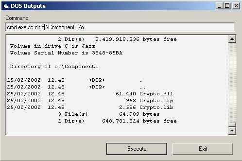



## Capture DOS Output

### Description

This class capture the outpus of a DOS command line via API functions, redirecting the

stdOutput pipe and the stdErr pipe of a DOS application from the screen to the pipe

that this class create.
 
### More Info
 

             |
---                |---
**Submitted On**   |2002-02-28 11:30:16
**By**             |[Marco Pipino](https://github.com/Planet-Source-Code/PSCIndex/blob/master/ByAuthor/marco-pipino.md)
**Level**          |Advanced
**User Rating**    |4.9 (209 globes from 43 users)
**Compatibility**  |VB 4\.0 \(32\-bit\), VB 5\.0, VB 6\.0
**Category**       |[Windows API Call/ Explanation](https://github.com/Planet-Source-Code/PSCIndex/blob/master/ByCategory/windows-api-call-explanation__1-39.md)
**World**          |[Visual Basic](https://github.com/Planet-Source-Code/PSCIndex/blob/master/ByWorld/visual-basic.md)
**Archive File**   |[DOS\_Output582652282002\.zip](https://github.com/Planet-Source-Code/marco-pipino-capture-dos-output__1-32180/archive/master.zip)

